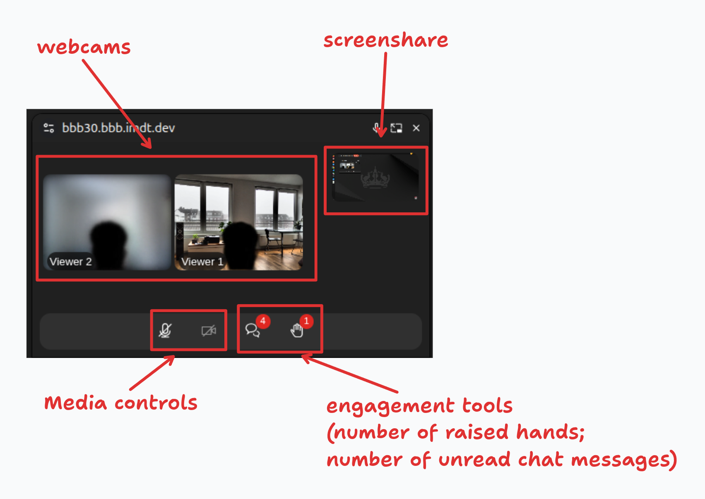

# BigBlueButton Picture-in-Picture Plugin

## Description

A plugin that starts up a picture-in-picture window with webcams and screen sharing in the session. Keeps video feeds visible in a floating window while you work in other tabs.



## Features

- **Picture-in-Picture window** — floating window with webcams and screen sharing, auto-opens when you switch tabs
- **Chat panel** — click the chat button inside the PiP window to open an inline message history panel (toast notifications for new messages are preserved)
- **User list popover** — click the users badge to see the names of all participants in the session
- **Audio & webcam controls** — mute/unmute and toggle your webcam directly from the PiP window
- **Raised hands** — see and lower raised hands without leaving the PiP window
- **Layout swap** — swap screenshare and webcam positions for presenter view
- **Yandex Browser support** — graceful fallback for Chromium-based browsers that do not support the `preferInitialWindowPlacement` option

## Supported Languages

- **be** — Belarusian
- **en** — English
- **pl** — Polish
- **pt-BR** — Portuguese (Brazil)
- **ru** — Russian
- **uk** — Ukrainian

## Building the Plugin

To build the plugin for production use, follow these steps:

```bash
cd $HOME/src/bigbluebutton-picture-in-picture
npm ci
npm run build-bundle
```

The above command will generate the `dist` folder, containing the bundled JavaScript file named `PluginPictureInPicture.js`. This file can be hosted on any HTTPS server along with its `manifest.json`.

If you install the Plugin separated to the manifest, remember to change the `javascriptEntrypointUrl` in the `manifest.json` to the correct endpoint.

To use the plugin in BigBlueButton, send this parameter along in create call:

```
pluginManifests=[{"url":"<your-domain>/path/to/manifest.json"}]
```

Or additionally, you can add this same configuration in the `.properties` file from `bbb-web` in `/usr/share/bbb-web/WEB-INF/classes/bigbluebutton.properties`


## Development mode

As for development mode (running this plugin from source), please, refer back to https://github.com/bigbluebutton/bigbluebutton-html-plugin-sdk section `Running the Plugin from Source`

## Changelog

### 1.0.0

- **Chat panel** — clicking the chat button inside the PiP window now opens an inline scrollable message history panel; toast notifications for new messages continue to work alongside it
- **User list popover** — the users badge button now shows a popover with the names of all session participants on click
- **Yandex Browser compatibility** — added fallback for `documentPictureInPicture.requestWindow()` in Chromium-based browsers that reject the `preferInitialWindowPlacement` option
- **Localisation** — added Russian (`ru`), Ukrainian (`uk`), Polish (`pl`), and Belarusian (`be`) translations for all UI strings
